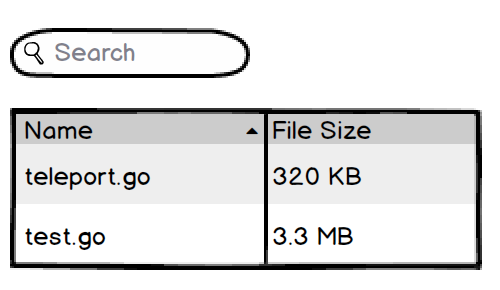

Teleport Frontend Application Developer Challenge
=================================================

As stated in Teleport's [challenge documentation][xdszuh], this challenge
implements a basic file browser as a client/server. The client is an SPA
(Single Page Application) which communicates with an HTTP server supplying the
directory contents. Requests for directory contents will be authenticated with
a username and password.

I'll split the challenge into two projects: the client and the server. Both
projects will be implemented in Typescript. They will both use build toolchains
consisting of:

- GNU Make
- yarn
- webpack
- babel
- typescript
- prettier
- eslint

[xdszuh]: https://github.com/gravitational/careers/blob/18be4e4073ad42f713691d4b11e2a971b84e1ad2/challenges/frontend/challenge.md


Client
======

## Dependencies

- React: required by the challenge (but I'd probably use it anyway)

Components will be implemented with JSX.

## Routes

### Header

Present on all routes. If the user is authenticated, will display a "Log out"
button. "Log out" will call `POST /api/logout` to expire the session on the
server, clear `Session-Id` from `localStorage`, then redirect to
`/logout`.

### `/`

Since this is a basic demo app, `/` will redirect to `/filebrowser/` (which will
redirect to `/login` if unauthenticated).

### `/login`

Components:

- LoginForm: A basic username/password login form with a submit button. Error
  messages will be displayed in red.


### `/logout`

Components:

- Logout: Basic logout success message with a link back to `/login`


### `/filebrowser/:filepath`

Components:

- FileBrowser: a container component
  - Breadcrumbs: a generic list of elements with a separator in between
  - DataGrid: a generic sortable table

Breadcrumbs Mockup:


DataGrid Mockup:




## Security Considerations

### Auth

Authentication and authorization will be handled using a session ID gotten from
the server's `/login` endpoint. The session ID will be stored in the browser's
`localStorage` and passed in authenticated requests using a `Session-Id` HTTP
header.

### CSRF (Cross-site request forgery)

CSRF attacks are not a concern for two reasons:

- There are no HTTP requests with side-effects, i.e. the server is stateless.
- Auth is handled manually with the `Session-Id` header, rather than
  automatically with a cookie.

### XSS (Cross-site scripting)

- All DOM manipulation will be done using React. React escapes all HTML input
  as long as [dangerouslySetInnerHTML][vpnufi] is avoided.
- Protection from `javascript:` and `data:` URIs will be provided by setting a
  restrictive [Content Security Policy][tlfkfk].

[vpnufi]: https://reactjs.org/docs/dom-elements.html#dangerouslysetinnerhtml
[tlfkfk]: https://developer.mozilla.org/en-US/docs/Web/HTTP/CSP


Server
======

## Dependencies

- node.js
- [express][kcrhfw]: It's the most popular HTTP server framework (last I
  checked) and I figure it'll cut down on some noise vs. coding directly against
  the node `http2.createServer` API.
- [argon2][cfwcpu]: implementation of OWASP's currently recommended password
  hashing function

[kcrhfw]: https://expressjs.com/
[cfwcpu]: https://www.npmjs.com/package/argon2

I'll also be including unit tests. Those will employ these development
dependencies:

- [mocha][hxxpec]: test runner
- [chai][ydmgmg]: assertion library

[hxxpec]: https://mochajs.org/
[ydmgmg]: https://www.chaijs.com/


## Endpoints

### `POST /api/login`

Creates a session, returning the session ID.

Request

```
POST /api/login HTTP/2
content-type: application/json

{
  "username": "zach",
  "password": "hunter2"
}
```

Response

```
HTTP/2 200 OK
content-type: application/json

{
  "sessionId": "<random session id>"
}
```

Error

```
HTTP/2 500 Internal Server Error
content-type: application/json

{
  "code": "${errorCode}",
  "message": "${User friendly error message}"
}
```

`errorCode` can be:

- `"login/failed"`: the username doesn't exist or the supplied password was
  incorrect


### `POST /api/logout`

Expires the session associated with the given `Session-Id`.

Request Headers

- `Session-Id` (string, required): the value received from a previous
  invocation of `POST /api/login`

Request

```
POST /api/login HTTP/2
content-type: application/json

{
  "username": "zach",
  "password": "hunter2"
}
```

Response

```
HTTP/2 200 OK
```

Error

```
HTTP/2 ${status} Status Message
content-type: application/json

{
  "code": "${errorCode}",
  "message": "${User friendly error message}"
}
```

Possible errors:

| `status` | `errorCode` | Description |
| --- | --- | --- |
| 401 | `"auth/sessionExpired"` | The Session-Id used in the request has expired.
| 401 | `"auth/sessionInvalid"` | The Session-Id used in the request is invalid.


### `GET /api/filebrowser/:filepath`

Request Headers

- `Session-Id` (string, required): the value received from a previous
  invocation of `POST /api/login`

Parameters

- `filepath` (string, optional): a `/`-separated absolute file path. Defaults
  to `"/"`.

Response

```
HTTP/2 200 OK
content-type: application/json

[
  {
    name: "teleport.go",
    sizeKb: 320,
    type: "file"
  },
  {
    name: "test.go",
    sizeKb: 3320,
    type: "file"
  }
]
```

Error

```
HTTP/2 ${status} Status Message
content-type: application/json

{
  "code": "${errorCode}",
  "message": "${User friendly error message}"
}
```

Possible errors:

| `status` | `errorCode` | Description |
| --- | --- | --- |
| 401 | `"auth/sessionExpired"` | The Session-Id used in the request has expired.
| 401 | `"auth/sessionInvalid"` | The Session-Id used in the request is invalid.
| 403 | `"auth/notAuthorized"` | The user is not authorized to make this request (requires the `read:filebrowser` permission).
| 500 | `"filebrowser/noEntry"` | The supplied `filepath` does not exist.


### `GET /*`

A GET request *not* starting with `/api/` will be interpreted as a request for a
static file. The root directory will be specified in an environment variable
`$CLIENT_ROOT`. This will be used to serve the build outputs of the client
such as "index.html", "index.js", "style.css", etc.

A request for a directory or a non-existent file will return the contents of
"index.html" to support reloading and bookmarking pushState-based client
routes.

> Security Note: will take special care to guard against requesting paths
  that lie outside $CLIENT_ROOT (e.g. using '..')


## Security Considerations

### MITM (man in the middle)

Per the default nowadays, the server will operate exclusively through HTTPS to
prevent man in the middle attacks. In development mode a self-signed
certificate will be generated.

### Password Storage

User accounts will be stored in a JSON file with the following structure:

```
[
  {
    "username": "zach",
    "passwordHash": "<hex-encoded hash>",
    "salt": "<hex-encoded salt>"
  }
]
```

Passwords will be hashed as follows:

1. The plaintext password will be hashed using SHA512. [This is a technique
   used by Dropbox to help defend against DoS attacks.][atpftb]
2. A random salt will be generated per-user. Length will be 128 bits (arbitrary
   choice; in a real application an optimal salt length could be computed using
   a [birthday problem approximation][jwgsnw]).
3. The SHA512 hash will be hashed again using **argon2id** with the random salt
   and parameters `m=37 MiB, t=1, p=1`, per current [OWASP
   recommendations][cjcbmz].
4. The resulting argon2id hash will be encrypted with an AES256
   [pepper][svzrcp].

[atpftb]: https://dropbox.tech/security/how-dropbox-securely-stores-your-passwords
[jwgsnw]: https://en.wikipedia.org/wiki/Birthday_problem#Probability_table
[cjcbmz]: https://cheatsheetseries.owasp.org/cheatsheets/Password_Storage_Cheat_Sheet.html#argon2id
[svzrcp]: https://cheatsheetseries.owasp.org/cheatsheets/Password_Storage_Cheat_Sheet.html#peppering


### Auth

Authentication and authorization will be handled using sessions. Sessions will
be stored in memory in a data structure with the following shape:

```typescript
type SessionId = string;

type Session = {
  id: SessionId;
  username: string;
  scopes: string[];
  lastActivityDate: Date;
  expirationDate: Date;
};

type SessionStore = Map<SessionId, Session>;
```

In a bit more detail:

- `id`: a 128-bit session ID. Randomly generated by a CSPRNG (cryptographically
  secure pseudorandom number generator), in node.js' case this will be
  `crypto.randomBytes`.
- `username`: the username of the authenticated user associated with this session
- `scopes`: a list of permissions for user access control. This application
  will only have one scope: `read:filebrowser`.
- `lastActivityDate`: timestamp of the last request which used this session ID.
  Used to implement an idle timeout. Idle timeout will be set at 30 minutes.
- `expirationDate`: timestamp used to implement an absolute session timeout.
  For this application I'll choose an absolute timeout of `${session creation
  time} + 8 hours`.

Sessions will be created as part of the `/api/login` endpoint.


Omissions
=========

I'm considering the following to be out of scope for this challenge. Please let
me know if any of these should be included!

Client:

- Production-mode build scripts
- Storybook tests

Server:

- Production-mode build scripts
- Database storage for users and directory listings (will use JSON files
  instead)
- Formal API documentation, e.g. Apiary
- Integration tests
- Containerization
- CI scripts
